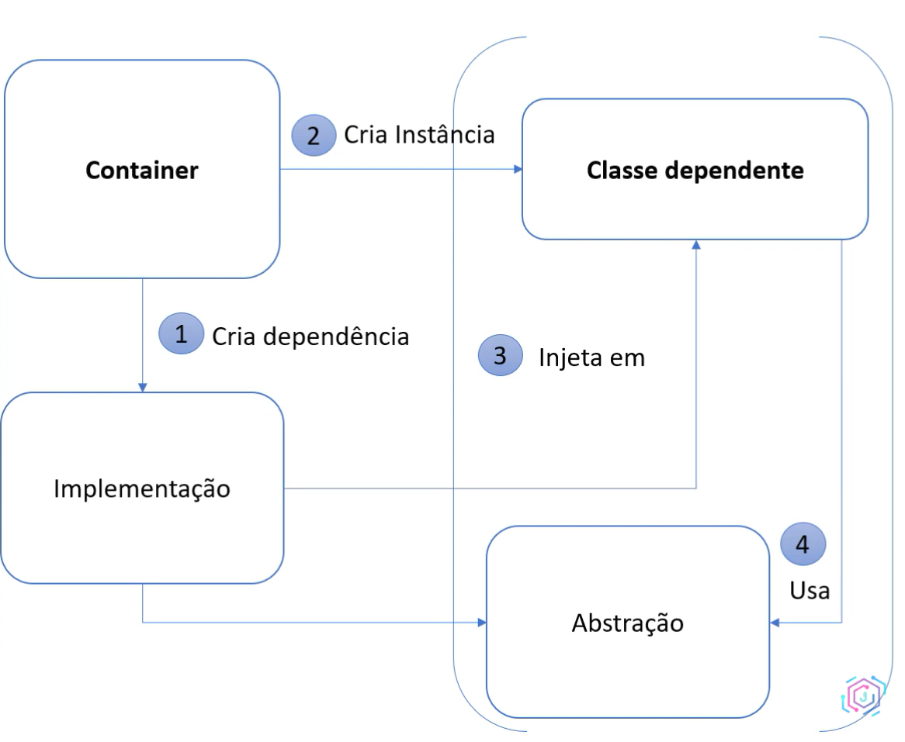
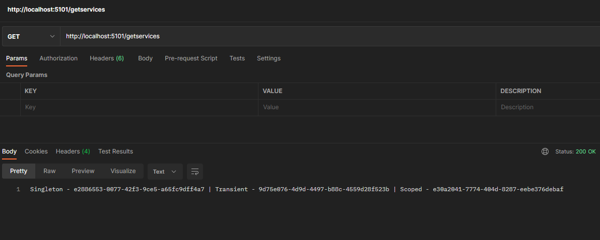
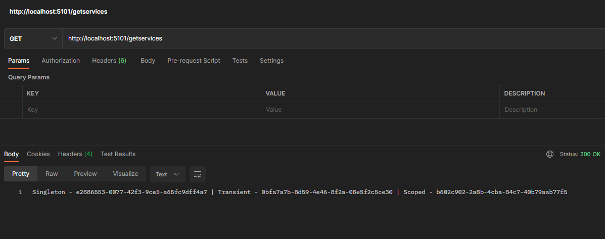

# Dependency Injection (DI)

Uma **dependência** é todo **instância** de uma **classe** feita por outra **classe**. Já uma Injeção de Dependência (ou do inglês, *dependency injection* - DI) é um **padrão de projeto** que implementa um outro **padrão de projeto**, que é a **Inversão de Controle**.

Precisamos utilizar esse *pattern* quando temos a necessidade de desenvolver sistemas em que o **nível de acomplamento** entre diferentes módulos sejam extremamente baixo. Quanto maior o nível de dependência dos módulos do sistema, maior acoplamento e maior a dificuldade de manutenção dos mesmos: imagine por exemplo, que para alterar uma módulo altamente acoplado, é necessário que vários outros sejam modificados também, e isso é um problema.

# Benefícios

- Oferece **reusabilidade** de componentes, uma vez que criamos componentes independentes, eles podem ser facilmente implementados em sistemas diversos;
- Facilitar a **manutenção** de Sistemas, fazendo com que as manutenções em módulos não afetem o restante do sistema;
- Criar códigos altamente **“testáveis”**. Uma vez que temos códigos implementados seguindo esse *pattern*, podemos testá-los mais facilmente utilizando os “*mock tests*”;
- Criar códigos **mais legíveis**, o que torna mais fácil a compreensão do sistema como um todo.

# Como funciona

Veremos como funciona:

1. O container cria primeiramente a dependência;
2. O container cria a instância;
3. Após os passos anteriores é injetado a implementação na classe dependente;
4. Finalmente a classe dependente usa a abstração dessa implementação.



# Ciclos de Vida

Os ciclos de vida em .NET são:

- **Singleton**: uma instância única durante todo o ciclo de vida da aplicação. Será criada no início e até o momento que a aplicação estiver viva, a instância também estará;
    - Usará a memória por todo o ciclo de vida, devido a isso, deve-se ter muito cuidado ao usar. Ele é mais utilizado em questões de configurações que existem na aplicação que será utilizado a todo momento e que não há necessidade de ficar recriando.
- **Transient**: serviços temporários de tempo de vida são criados cada vez que são solicitados pelo contêiner de serviço. Todo o momento que solicitar o container de serviço, irá criar uma instância temporária para cada serviço solicitado;
    - Esse ciclo de vida funciona melhor para serviços leves e sem estado.
- **Scoped**: Duração de um escopo (definido pelo programador ou não);
    - [ASP.NET](http://ASP.NET) define como escopo padrão a um request.

## Escopos

Escopo é um conjunto de operaões pré definidos que definirão o ciclo de vida de um objeto **Scoped**. Instâncias do tipo **Scoped** serão liberadas ao fim do escopo.

Se houver implementação da interface `IDisposable`, o método `Dispose` será chamada automaticamente para liberar memória.

Para utilizar um escopo próprio utilizamos a interface `IServiceScopeFactory`.

# Implementando um teste

Iremos criar para este teste, 4 interface. A primeira se chamará `IOperation` e terá uma propriedade:

```csharp
public interface IOperation
{
    string OperationId { get; }
}
```

As outras três serão uma para cada ciclo de vida existente:

```csharp
public interface IOperationTransient : IOperation
{
}
```

```csharp
public interface IOperationSingleton : IOperation
{
}
```

```csharp
public interface IOperationScoped : IOperation
{
}
```

Observe que todas elas implementam de `IOperation`. E finalmente a implementação `Operation`:

```csharp
public class Operation : IOperationTransient, IOperationScoped, IOperationSingleton
{
    public Operation()
    {
        OperationId = Guid.NewGuid().ToString();
    }

    public string OperationId { get; }
}
```

Observe que a classe somente implementa a propriedade `OperationId` e a inicia no construtor. 

Essas três interfaces foram criadas para criar três ciclos diferentes na injeção de dependência, como foi configurado no Program:

```csharp
// Builder
var builder = WebApplication.CreateBuilder(args);

builder.Services.AddTransient<IOperationTransient, Operation>();
builder.Services.AddScoped<IOperationScoped, Operation>();
builder.Services.AddSingleton<IOperationSingleton, Operation>();

// App
var app = builder.Build();

app.MapGet("/getservices", 
    (IOperationTransient opTransient, 
    IOperationSingleton opSingleton, 
    IOperationScoped opScoped) => {

        return $"Singleton - {opSingleton.OperationId} | Transient - {opTransient.OperationId} | Scoped - {opScoped.OperationId}";
    }
);

app.Run();
```

Observe que injetamos as interfaces/implementações com base no seu respectivo ciclo de vida. Já na rota `/getservices` usamos a DI com base em suas abstrações/interfaces e exibimos o valor do `OperationId` de cada uma delas.

Ao fazer a primeira requisição é possível ver os códigos:



e para testar fazemos outra requisição:



Concluímos então que o **Singleton** permanece o mesmo, já que ele foi criado ao rodar a aplicação. O **Scoped** e **Transient** mudaram de uma requisição para a outra.